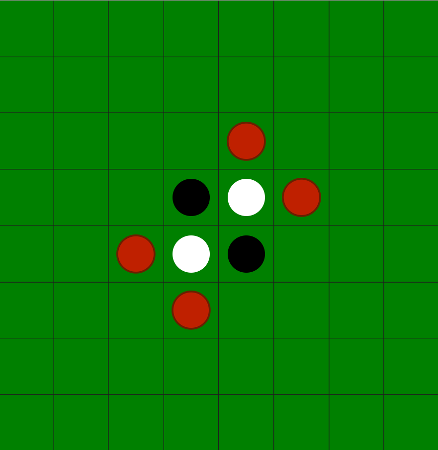

# Othello
<<<<<<< HEAD
The board game Othello built in JavaFX.
## How to Play
Basic rules for the game are as follows:

- Player's toss a coin to decide who will play white - white moves first. Each turn, the player places one piece on the board with their colour facing up.

- For the first four moves, the players must play to one of the four squares in the middle of the board and no pieces are captured or reversed.

- Each piece played must be laid adjacent to an opponent's piece so that the opponent's piece or a row of opponent's pieces is flanked by the new piece and another piece of the player's colour. All of the opponent's pieces between these two pieces are 'captured' and turned over to match the player's colour.

- It can happen that a piece is played so that pieces or rows of pieces in more than one direction are trapped between the new piece played and other pieces of the same colour. In this case, all the pieces in all viable directions are turned over.

- The game is over when neither player has a legal move (i.e. a move that captures at least one opposing piece) or when the board is full.

## Getting Started
### How to Install
Clone the repository to your local machine using Github's built-in features or on the command-line using `git clone <repository-URL>`.
### How to Run
- Using IntelliJ as your IDE, import the project.
- Once the project is open, go to **File > Project Structure > Libraries > +** and navigate to your local JavaFX `lib` file to add it to the project.
- Open the project configuration menu located at the top right of the IDE and select **Edit Configuration**.
- Add `--module-path ${PATH_TO_FX} --add-modules javafx.controls,javafx.fxml` to the **VM Options** if it is not added already (it should be).
- Choose the `Othello [run]` configuration and press **Run** to see the program. 
=======
An Othello game with AI opponent and strategic analysis.
>>>>>>> 89c4a26865c7f66e38b13f1a27b561ca6e35d6d6
